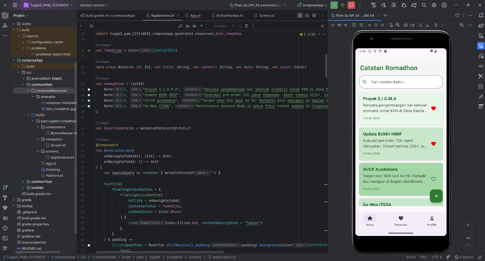
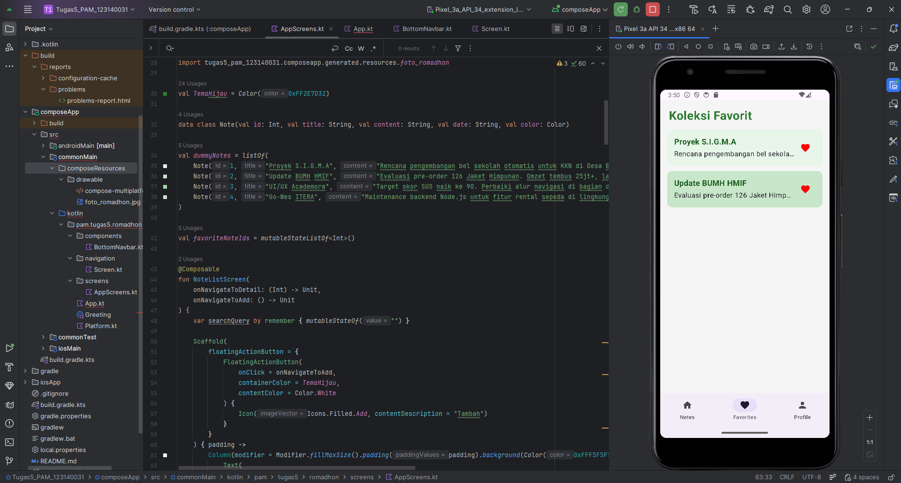

# Tugas 5 Pemrograman Aplikasi Mobile = Notes App

Muhammad Romadhon Santoso
123140031
Pemrograman Aplikasi Mobile RB

Aplikasi ini merupakan implementasi navigasi multi-layar menggunakan Compose Multiplatform. Fokus utama dari proyek ini adalah penerapan struktur navigasi yang efisien dan user-friendly untuk mengelola catatan pribadi dengan antarmuka yang modern.

Aplikasi ini mengintegrasikan sistem Bottom Navigation yang menghubungkan tiga menu utama yaitu daftar catatan, koleksi favorit, dan profil pengguna. Selain itu, terdapat fitur Navigation Drawer untuk akses menu samping serta penggunaan Floating Action Button untuk menambah catatan baru. Secara teknis, aplikasi ini telah berhasil menerapkan konsep Passing Arguments menggunakan `noteId` sebagai identitas unik saat berpindah dari layar daftar menuju layar detail maupun layar edit. Hal ini memastikan bahwa data yang ditampilkan pada layar tujuan sesuai dengan item yang dipilih oleh pengguna pada layar sebelumnya.

## Dokumentasi Antarmuka

Berikut adalah tampilan antarmuka aplikasi saat dijalankan:

### Demo Video
Silakan klik tautan di bawah ini untuk melihat demonstrasi fungsionalitas navigasi aplikasi:
[Tonton Demo Video di YouTube](https://youtu.be/HePZcZ8YNmc)